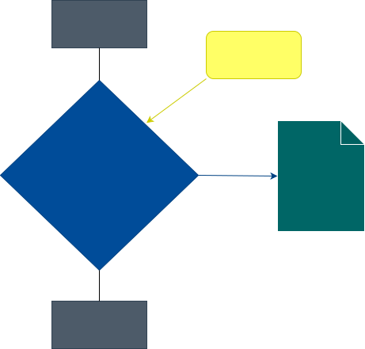

# 

> ### Event Driven Architecture Vanilla JS Web Components codebase containing real world examples (CRUD, auth, advanced patterns, etc) that adheres to the [RealWorld](https://github.com/gothinkster/realworld) spec and API.


### [Demo](https://mits-gossau.github.io/event-driven-web-components-realworld-example-app)&nbsp;&nbsp;&nbsp;&nbsp;[Test](https://mits-gossau.github.io/event-driven-web-components-realworld-example-app/test)&nbsp;&nbsp;&nbsp;&nbsp;[RealWorld](https://github.com/gothinkster/realworld)
```diff
- Work in progress...
```


This codebase was created to demonstrate a fully fledged fullstack application built with Event Driven Vanilla JS Web Components including CRUD operations, authentication, routing, pagination, and more.

We've gone to great lengths to adhere to the **Document Object Model (DOM)** community styleguides & best practices.

For more information on how to this works with other frontends/backends, head over to the [RealWorld](https://github.com/gothinkster/realworld) repo.


# How it works

> Frontend Event Driven Architecture works basically like the DOM itself. There are loosely coupled components (nodes), which emmit events and those get captured by controllers called stores, routers, etc. 

# Getting started

> Simply open the index.html on a local or remote web server like, node, apache, nginx, etc.

# Diagrams

### Index.html

### pages/Home.js


# Explanations

* **ShadowDOM**'s mostly shine when encapsulating CSS. But the Conduit example has one global CSS Stylesheet and for that reason, it is more efficient to not have shadowDOM's, which all would have to import that global CSS separately. Note: The biggest strength of Web Components is their shadowDOM, means in a real life examples you would share general CSS styles through CSS variables and have specific styles on each component in their respective shadowDOM. This will improve performance, since the DOM renderer only needs to respect certain CSS for certain nodes/shadowDOM's. There is a good helper Class, which you can use to simply add CSS with the lines: ```this.css = '...' ``` and to avoid resetting nodes with innerHTML, it includes a function: ```this.html = '' ```. Overall, this prototype Class helps you to easily and comfortably deal with the ShadowDOM. Have a look at: [Weedshaker's web components *(work in progress)*](https://github.com/Weedshaker/web-components/blob/master/prototypes/MasterShadow.js)

# Lighthouse Audits

## [React / Redux (81)](https://github.com/gothinkster/react-redux-realworld-example-app)


## [Angular (75)](https://github.com/gothinkster/angular-realworld-example-app)


## [Vue (82)](https://github.com/gothinkster/vue-realworld-example-app)


## [Vanilla JS Web Components (92)](https://github.com/gothinkster/web-components-realworld-example-app)


## Event Driven Vanilla JS Web Components (95)


# TODO

0. home/favorite(d)
0. header/newPost
3. header/profile
0. otherUser/profile
0. following
4. editor
5. article/comments etc.
0. clean error handling at controller level (linter is complaining if there are no error handlings)
